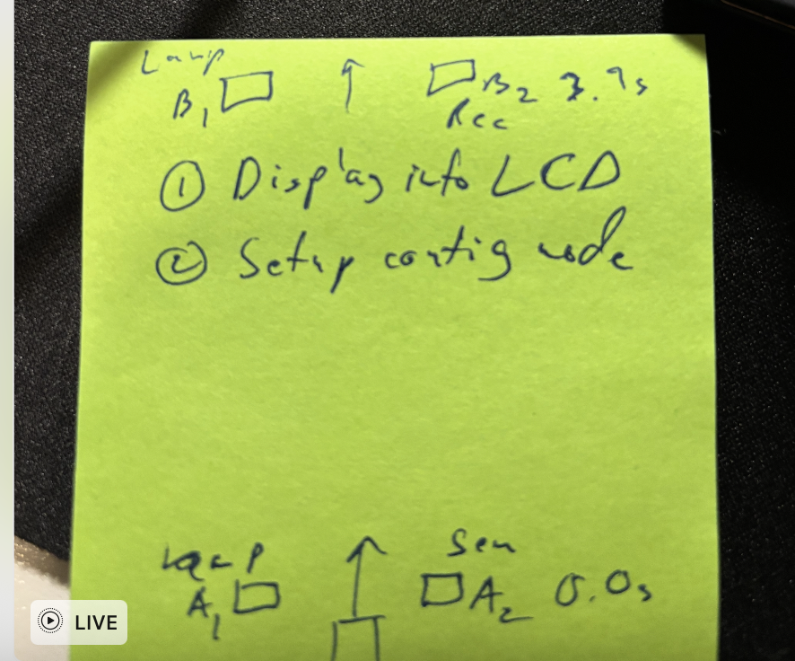

# lightgate




## Overview (As of rn)

- **Sender**: reads sensor data, detects threshold events, and transmits messages  
- **Receiver**: listens for ESP-NOW messages and triggers an LED on HIGH events  

The device role is selected at **build time** using `menuconfig`.

---

## How to Run

### 1. Clone and set up the project
```bash
git clone <repo>
cd <repo>
source ~/esp/esp-idf/export.sh
idf.py build
```


### 2. Select device role
```bash
idf.py menuconfig
```
Navigate to: 

App config
* Device role
  
** Sender   (transmit ESP-NOW on HIGH)

** Receiver (listen for ESP-NOW; no transmit on remote HIGH)


### Project Architecture
High-level Flow

- main.c is the program entry point
- A single role is chosen at build time

- The selected role provides app_role_start()

- main.c calls app_role_start() to start role-specific logic

### File Responsibilities
main.c
- Role-agnostic entry point

- Calls app_role_start()

- Role selection is determined at build time:

- CONFIG_ROLE_TX → sender.c

- CONFIG_ROLE_RX → receiver.c

sender.c (TX role)
Handles sensing, classification, and transmission.

- Initialize ESP-NOW

- Wi-Fi setup

- Peer registration

- Send callback

- Initialize and start sensor subsystem

- Define thresholds and state machine (LOW / MID / HIGH)

- Decide when to transmit ESP-NOW messages

- Log system behavior

- Sensor workflow:

- - Calls:

* * sensor_init(channels)

* * sensor_start()

* * sensor_read_window(500 ms, &window)

- Decision logic:

* * If window.max_raw >= HIGH_THRESH → send ESP-NOW HIGH message

* * If window.min_raw <= LOW_THRESH → perform LOW action

receiver.c (RX role)

Handles reception and actuation.


- Initialize ESP-NOW

- Wi-Fi setup

- Receive callback

- Configure LED GPIO

- Run LED task

- Parse and log received messages

